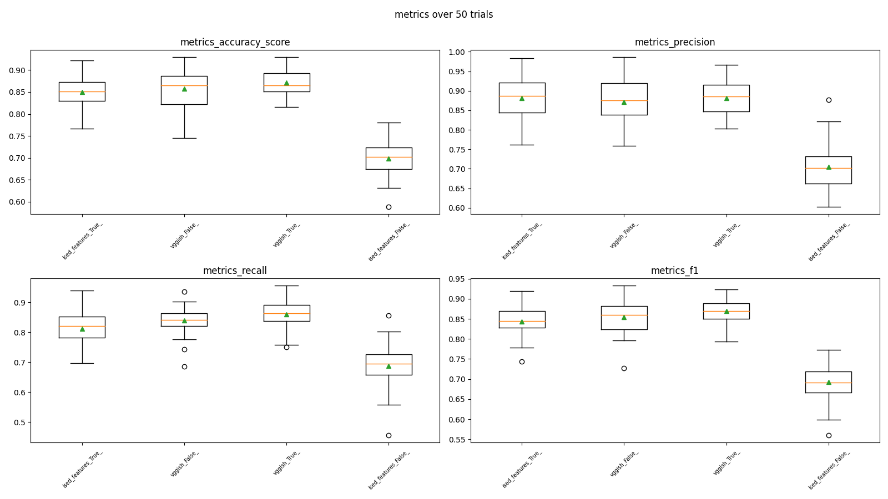
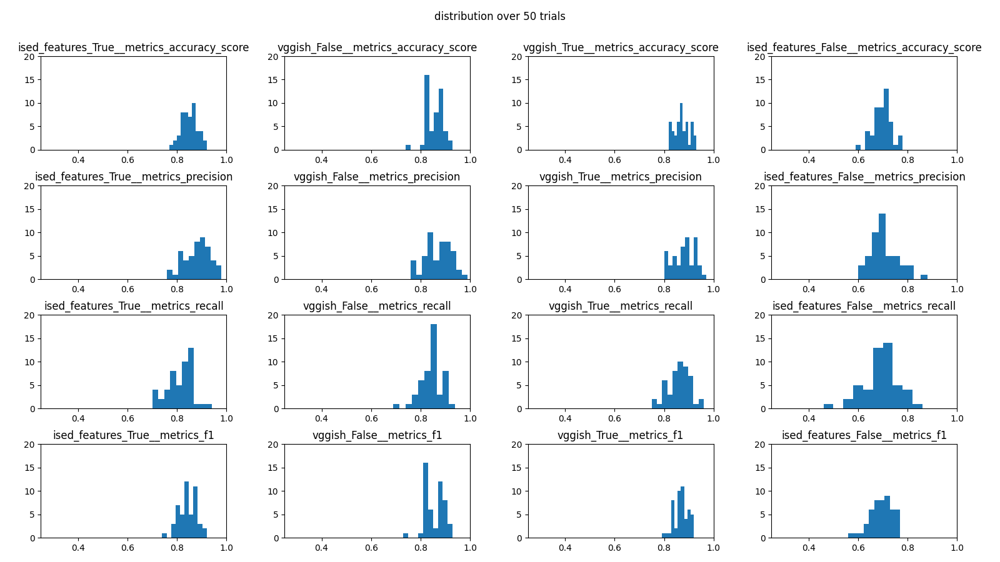

## what i did 
ran 50 trials of the following 4 conditions:

- condition 1:
	- features: vggish
	- fischer weights: true
- condition 2:
	- features: vggish
	- fischer weights: false
- condition 3:
	- features: ised
	- fischer weights: true
- condition 4:
	- features: ised
	- fischer weights: false

other trial parameters:

- number of training samples: 200
- number of validation samples: 140
- total size of dataset: (roughly) 1300 samples (about 650 per class)

every trial, a subset of the dataset would be randomly sampled with a fixed random seed for all for conditions. the seed number for each experiment is stored in its .yaml config. 

## results

boxplots of accuracy, precision, recall, and f1 for each of the different models. the green triangles are means

observations (accuracy):

- although ised-weights, vggish-noweights, vggish-weights all shared a median (and mean) of about 0.85% accuracy, vggish-weights looks like it has a considerably narrower distribution than ised-weights and vggish-noweights. 
- ised-noweights loses, with a mean of 70% accuracy. 

distributions of metrics over the trials for each of the different models. 

## questions

- Does reweighting features using Fischer's method help VGGish?
	- looking at accuracy we can see that the boxplots for VGGish-noweights and VGGish-weights are not symmetric and don't have similar spreads. Thus, let's look at the Wilcoxon signed rank test results. 
(from `./stat_tests/metrics_accuracy_score.csv`)

| conditions | wilcoxon-stat | wilcoxon- p value|
| --- | --- | ---|
|VGGish-noweights -> VGGish-weights| 334 | 0.01483|

Since the `p_value = 0.01483` < 0.05, we know that our difference is statistically significant. Moreover, we see that the VGGish-weights a narrower distribution that VGGish-noweights, concentrated between 0.83-0.87 in the inter-quartile range. 

- Does it help ISED?  
	- yes. from the boxplots, we can see a huge jump in accuracy, from 70% to around 85%. 
	- moreover, let's look at out wilcoxon test:
	
| conditions | wilcoxon-stat | wilcoxon- p value|
| --- | --- | ---|
|ISED-noweights -> ISED-weights| 0 | 1.009E-09|

Our wilcoxon also test indicates that the differences are statistically significant

- Do VGGish features work better than ISED features for Sound event detection (SED)?
	- since we know that both models perform better with weights, lets compare both models with weights:
	
| conditions | wilcoxon-stat | wilcoxon- p value|
| --- | --- | ---|
|ISED-weights -> VGGish-weights| 280 | 0.007307 |

Our Wilcoxon test indicates that the differences are statistically significant. Again, the VGGish-weights accuracy distribution over the trials is much narrower.

- Does VGGish without weights perform better than ISED with weights? 

| conditions | wilcoxon-stat | wilcoxon- p value|
| --- | --- | ---|
|ISED-weights -> VGGish-noweights| 471.5 | 0.327 |

With a `p_value = 0.327`, it looks like the difference between our two sets is not statistically significant, indicating thay they will perform roughly the same? 
