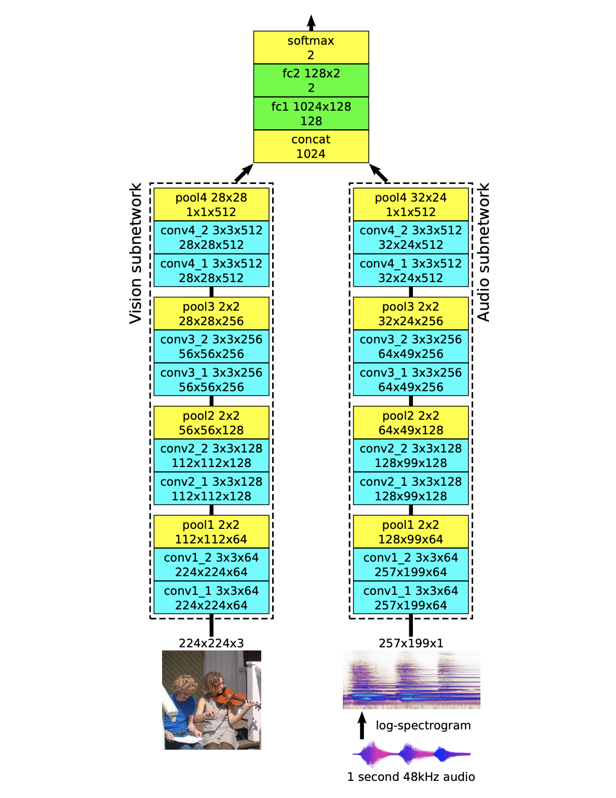
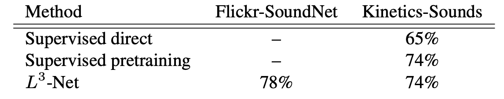

# Look, Listen and Learn
#### authors: Relja Arandjelovic (DeepMind), Andrew Zisserman (DeepMind, VGG)

### previous work
- MIT (SoundNet) had done work on audiovisual correspondence before this, but with a different goal. Their models were trained separately for each mode, for example, a "visual network to generate sounds, or an audio network to correlate with visual outputs".
- "SyncNet" aims to synchronize lip-regions and speech for lip-reading. So, some sort of Audio-Visual Correspondence, but maybe not as generalized as this. 

## Audio-Visual Correspondence
- The authors propose the novel Audio-Visual Correspondence learning task. 
	- co-training: 
		- there are two views of the data: audio, video
		- each view provides complementary information about the data
	- a quote from the paper that puts things nicely:
		- "By seeing and hearing many examples of a person playing a violin and examples of a dog barking, and never, or at least very infrequently, seeing a violin being played while hearing a dog bark and vice versa, it should be possible to conclude what a violin and a dog look and sound like, without ever being explicitly taught what is a violin or a dog."
- the task:
	- the task itself is simple: determine whether a video frame and an audio snippet correspond to each other or not. 
	- the corresponding pairs are taken from the same video, while mismatched pairs are taken from different videos.
	- the model must learn the semantic concepts in both the visual and audio domain

### network architecture
Figure 2 makes figuring the architecture out pretty easy. 

three parts:

1. vision subnetwork: 
	- input: 224 x 224 rgb image
	- VGG design style:
		- 3x3 conv filters
		- 2x2 max-pooling with stride 2 and no padding (downsampling)
		- one block: conv+conv+pool 
			- each conv layer inside one block has the same number of filters
		- consecutive blocks double filter numbers:
			- 64, 128, 256, 512
	- at the end, max-pooling is performed across all spatial locations to produce a single 512-D feature vector
	- each conv layer has a batchnorm and ReLU layers. 
2. audio subnetwork:
	- input: 1 second audio clip --> log spectrogram
		- _note:_ I don't think they're using mel-spaced bins, which I believe could be helpful. 
		- greyscale 257x199 image
	- same architecure as the video subnetwork, with the exception that the image is greyscale, meaning that we will have filters that are 3x smaller compared to the vision subnetwork
	- the output feature vector is also 512-D
3. fusion network:
	- a concat layer (to concatenate both audio and visual embeddings)
	- two fully connected layers with ReLU, and an intermediate feature size of 128D. 
	- output: 2D softmax, determining whether the video corresponds to the audio or not. 

## results
### evaluation of audiovisual correspondence training
#### supervised baselines

- The visual and audio networks were trained independently on the action classification task (using the Kinetics-Sounds dataset)
- The visual network is addded two fully connected layers to perform classification into the kinetics-sound classes. The audio network does the same thing.
	- two different ways of computing Audio Visual Correspondence (in a supervised way):
		- **direct combination**: computes AVC as the dot product of class score distributions of the separate audio and visual networks. If the dot product passes a certain threshold, the inputs are in correspondence. 
		- **supervised pre-training** baseline takes the feature extraction subnetworks (after being pre-trained in a supervised task (classification)), connects it to the rest of the network in [fig2], and performs the AVC task. 

##### result of this

- Table 1 suggests that there is no real need to pre-train the embeddings in a supervised task. The **direct combination** baseline actually performed worse (which makes sense, since it was not trained for the AVC task. L3-net performs equally as the **supervised pre-training** baseline. 
	
-	_note_: the network performs with a 74% and 78% percent accuracy on the AVC task.

### the cool part! using the L3 audio subnetwork as an embedding

- outperformed state of the art (SoundNet) in the DCASE task, with a 5% increase in accuracy, all while learning unsupervised!
	
- The authors were able to _localize_ the source of an audio event in the video frame. Certain images activate certain units in the _pool4_ layer of the video subnetwork the most. This demonstrates that the vision subnetwork has learnt the semantic representations of things like guitars, accordions, etc.  

## discussion
### one of the bigger takeaways
This model learns in a self-supervised manner, and has a "virtually infinite source of free supervision (video with visual and audio modes)". 

- This is a step up from VGGish, since VGGish was trained on the (labeled) YouTube 100M dataset. 

### what could be the next steps? 
- **mel spectrogram**: the authors used a linearly spaced freq bins in their spectrogram represenation. I wonder if using mel spaced bins would make learning the audio embedding an easier task, since it  corresponds more with human perception of sound. 

- **end to end learning**: this is more of a question, but what would be the effect of ditching the spectrogram input, using conv1D layers, and let the network learn the filters it wants to use on the raw audio by itself? 
	- Moreover, if you still wanted to use conv2D layers at one point, you could stack the output of 64 conv1D channels to make a pseudo-spectrogram representation with 64 filter bins, correct? 
	- after stacking the channels, you would end up with **Batch x Channel x Time** dimensions, where the Channel would correspond to a Conv1D filter, which (we know from DSP) is just an ordinary filter (time-domain convolution is frequency-domain multiplication). You could then use this representation in place of a spectrogram. 
- **true \*false positives in AVC task**: What happens when the video subnetwork gets a frame of a violin, the audio subnetwork gets a clip of a violin, but the frame and audio don't belong to the same video? The AVC loss would penalize the network for this, but the audio and video do semantically match. Could this be hurting the network? 

- **adding a recurrent layer and training on a sequence of video frames**: could this help the AVC task AND produce a more meaningful audio embedding? We have the data, so why not? 

