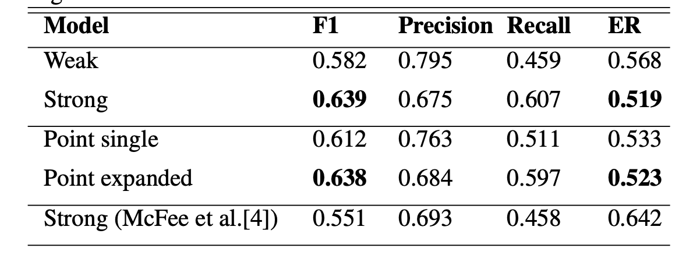

# Sound Event Detection Using Point-Labeled Data
#### authors: Bongjun Kim, Bryan Pardo

## sound event labeling:


(fig. 1) really drives the *_point_* home! hahaha

- *weak*: only indicates if a sound event is present in the entire audio file or not. No timestamp
	- _adv_: easy for humans to do as a job
	- _disavd_: no time boundary info. bad performance when you're trying to provide time boundaries. 

- *strong*: indicates onsets and offsets of a sound event
	- _adv_: the ideal kind of labeling we want
	- _disadv_: time consuming for mere mortals

- *point* (_proposed by authors!_): indicates position where sound event occured, without having to annotate onsets and offsets
	- _adv_: easy for mere mortals, while still providing location info!
	- _disadv_: no info on onsets and offsets, will need to estimate some other way (using similarity measure)

## point label loss

### point label encoding
point labels are encoded in a matrix with dimensions (C, T), where C is the number of sound classes and T is the number of timesteps. 

### false negatives
since point labels indicate info only about the presence (not absence) of an event, this will result in  false negatives:

```
strong_label = [0, 0, 0, 1, 1, 1, 1, 0, 0, 0]

point_target = [0, 0, 0, 1, 0, 0, 0, 0, 0, 0]
point_pred   = [0, 0, 0, 0, 1, 0, 0, 0, 0, 0]

loss = criterion(point_target, point_pred)
```
although these are both right, a simple binary cross-entropy loss would penalize this. instead, compute 
```
loss = criterion(point_target, point_pred * point_target)
```

This only computes loss on timesteps where there is a 1 in point_target, which leaves a lot of audio that is not trained on. To compensate for this, add a weak label loss, and weigh with hyperparameter alpha:

```
def point_label_loss(point_target, point_pred, alpha):
	loss_point = binary_cross_entropy(point_target, point_pred)
	
	weak_target = max(point_target)
	weak_pred = max(point_pred)
	
	loss_weak = binary_cross_entropy(weak_target, weak_pred)
	
	return (1-alpha)*loss_weak + alpha*loss_point
	
```

### point-expanded form 

- a way of expanding point labels into a pseudo strong label
- if used as ground truth during training, expanding a ground-truth point label may create false positive ground truth labels, which will hurt learning. 

#### expanding point labels

to measure similarities: 
- *weak model*: build a SED model on a training set with only weak labels
- now, apply the *weak* model to label each audio clip in the training set at the segment level (1/3 of a second) to obtain segment-level class probabilities of each training example (i.e. yhat)
- This results in a feature embedding. Now you can use this embeddings as the data to compare similarities on!!
- *observation*: since VGGish is a pretty good audio embedding, wouldn't it be easier to use VGGish as the weak model? 

- set a similarity threshold between adjacent frames
- if a frame has a 1, compute similarity between adjacent frames using a similarity measure. 
- if the similarity of adjacent frames  > threshold
	- then: mark adjacent frame as 1 too
	- else: mark as 0 

## experiments

compare three models in SED task:

- weakly labeled model 
- point labeled model
- strongly labeled model 

### model
- fully conv network. 
- input: log mel-spectrogram of variable length
- timestep: 1/3 seconds of audio

- layers 1 to 6 were initialized to VGGish weights.

### results


- point single form did better than weak labeling 
- point expanded form got super close to strong labeling!


## questions
- I believe the paper doesn't talk about the performance of the point-expander. 
	- Would it be worth it to compare a point-expanded prediction to a strongly labeled ground truth to evaluate the performance of the point expanding algorithm? 
	- Could the point expanding algorithm be improved with other similarity measures? 

- For the model: why not use VGGish 128D embedding plus fully connected layers for classification? I guess this restricts the timestep to 1s, since that's the timestep used in VGGish. However, is a 1s resolution enough? 

- Similarity measure: Again, could you use the VGGish embedding (instead of the class probabilities) as feature vectors to compute similarity between two timesteps? 


