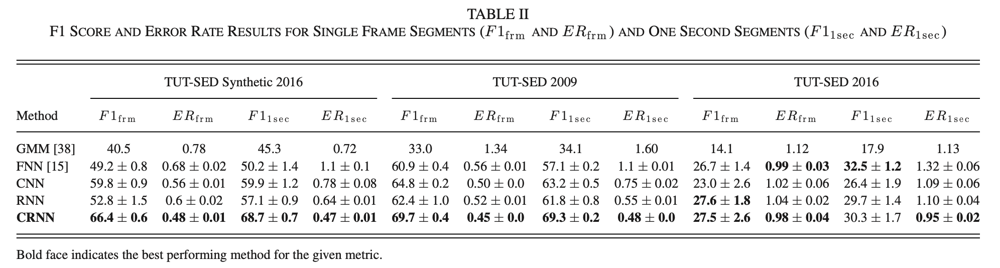
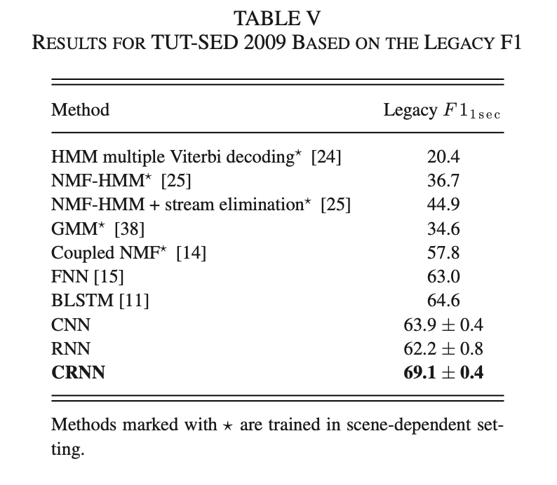
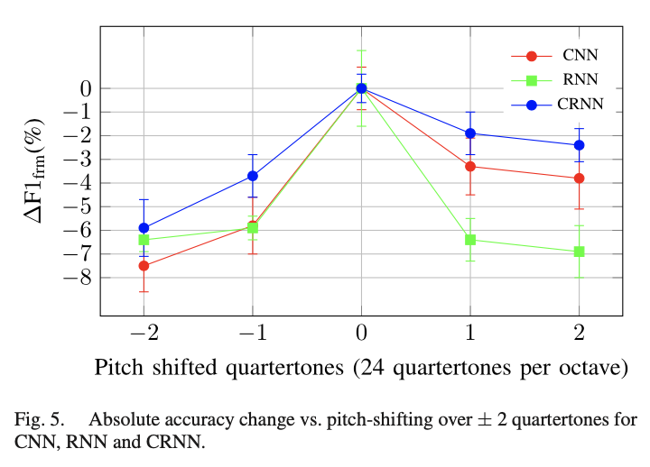
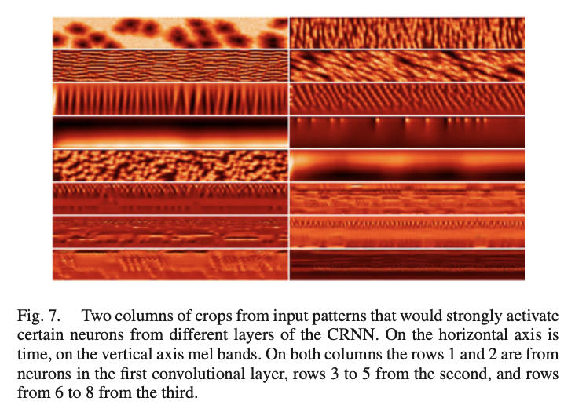

## Convolutional Recurrent Neural Networks for Polyphonic Sound Event Detection
### authors: Emre Çakir, Giambattista Parascandolo, Toni Heittola, Heikki Huttunen, and Tuomas Virtanen

### the takeaway
- the authors use a conv -> rnn -> fully connected architecture for sound event detection. 
- the conv acts as a feature extractor
	- max pooling is done only in frequency axis, which helps introduce frequency invariance (because a bark centered at 400Hz is no different than one at 700Hz)
- the recurrent layer introduces temporal context
	- things with impulse-like characteristics (like glass smashing) vs things like rain.
- fc layers are used for classification

### the problem with fully connected nets
- lacks time and frequency invariance -> fixed connections between input and hidden units allow to model small variations in events that could be hurtful. 
	- we can fix this with a CNN, by using filters that are shifted in both time and frequency 
- temporal context is restricted to short time windows, preventing effective modeling of longer events like rain, and correlations between different events
	- ah, ha! this is where an RNN would come in handy.

### model architecture

spectrogram --> conv layers -> recurrent layer -> fully connected layers

- spectrogram is our input representation
- conv layers act as feature extractors
- recurrent layer gets temporal context
- fully connected layers do classification

#### conv layers
- conv2d -> maxpool2d -> ReLU
- the authors emphasize the use of maxpooling ONLY on the frequency axis to introduce frequency invariance. The time dimension remains intact. 
	- this had been previously done in [21] and [31]. (references from the paper). 
	- the time axis is left untouched to preserve alignment between each target output vector and hidden activations. 

- *output*: a (M, F', T) tensor, where
	- M: number of feature maps
	- F': frequency bands after maxpooling
	- T: time

#### recurrent layers

- output from conv layers is reshaped to (M*F', T) 
- then, each timestep from the T dimension is fed one by one to the RNN, which consists of L stacked hidden GRU units. 
	-  *note*: I don't know much about design choices for recurrent layers, and know very little about LSTM, GRU, and other recurrent architectures. Perhaps this is something I could catch up on for next week.

#### feedforward layer
- a single feedforward layer with sigmoid activation is used for classification. The layer outputs class probabilities, which are then  discretized to 0 and 1 using a threshold C. 

 

#### other design notes

- 5x5 kernels are used in all of the conv layers
- dropout is used throughout the network. 
- batch normalization is used after every conv or fc layer, to speed up training. A batch is normalized to zero mean and unit variance
- really long sequences are used, with up to thousands of steps. 
	> while very long term context is not helpful in speech processing, since words and utterances are quite short in time, in SED there are several events that span over several seconds. 
	

### evaluation

#### models to be compared
- pure RNN
- pure CNN
- CRNN (**proposed here**)
- GMM

#### scene independent training:
- the authors approach the task as scene-independent. 
- a single model is trained per dataset, regardless of the prescence of different acoustic scenes. 

#### datasets
- *TUT Sound Events Synthetic 2016*
	-  primary evaluation dataset used.
	- 100 mixtures, 60/20/20 train/val/test split
	- 16 classes, mixtures created by mixing isolated sound events. 
	- mixing 994 sound event samples
	> Mixtures were created by randomly selecting event instance and from it, randomly, a segment of length 3-15 seconds. Mixtures do not contain any additional background noise. 
	- *note*: Isn't the lack of background noise problematic? 

- *TUT Sound Events 2009*: 
	- real life recordings from 10 different scenes. 
	- 1113 minutes
	- 61 classes defined. 
	- average number of concurrent events: 2.53
	- proprietary

- *CHiME-Home*:
	- 	4 second audio chunks from home environments. 
	-  seven sound classes
	-  1946 chunks for development, 846 chuks for evaluation
	-  annotations are made per chunk (**weak labeling?**)

- *TUT Sound Events 2016*:
	- recordings from two real-life scenes: residential are and home.
	- large variability on active sound event classes between recordings
	- up to 78 mins of audio (really small)

### results

<!--##### TUT-SED Synthetic 2016

##### TUT-SED 2009

##### CHiME-Home:

-->

#### frequency shift invariance

> In order to investigate the robustness of the networks to small frequency variations, pitch shift experiments are conducted and the absolute changes in frame-based F1 score are presented in Fig. 5.

- CRNN shows the best frequency shift invariance, though the difference still looks significant, especially for a -2 quarter tone shift. 

- *note*: quartertones seem like a small interval to measure differences from, at least coming from human perception. 

#### visualizing the filters
how they did this:

- choose a target filter
- feed the network a random input from a gaussian distribution
- compute the gradient of the target filter wrt. the input
- iteratively update thru gradient ascent to increase the activation of the neuron. 

### questions

#### synthetic vs non-synthetic datasets and context
*note*: the difference between a synthetic/not synthetic audio dataset gave me an idea that builds upon something I wondered about OpenL3.

Besides background noise, another big difference I can think about synthetic/not synthetic datasets is that non-synthetic datasets will contain sound events that share a context/joint probability. 

Wouldn't the net learn better if there was a relationship between events? i.e. thunder is likely to happen before rain, etc. And be able to model these temporal relationships with an LSTM/transformer. 

Sort of like an attention mechanism? I JUST read the transformer paper so this is what popped into my head. 

#### frequency shift invariance
- do the results in Fig. 5 mean that the maxpooling in the conv layers wasn't effective enough to make the model robust to frequency shifts?  
- what other techniques can be used to make the model more robust to frequency shifts? 

I put a word counter on my markdown editor, and I'm 50, 49, 47, words away from hitting 1000. I shall stop here. 

