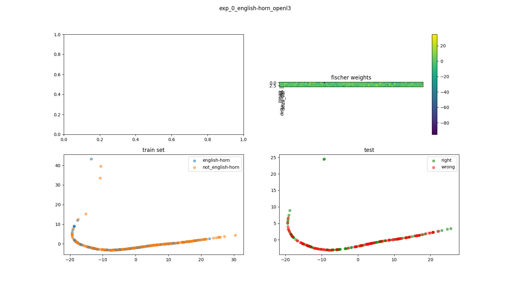
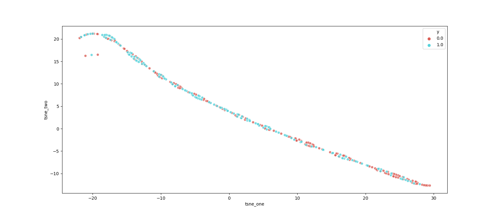
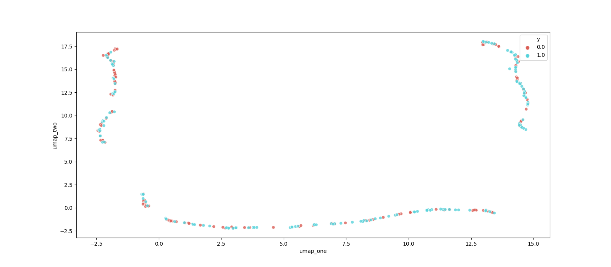
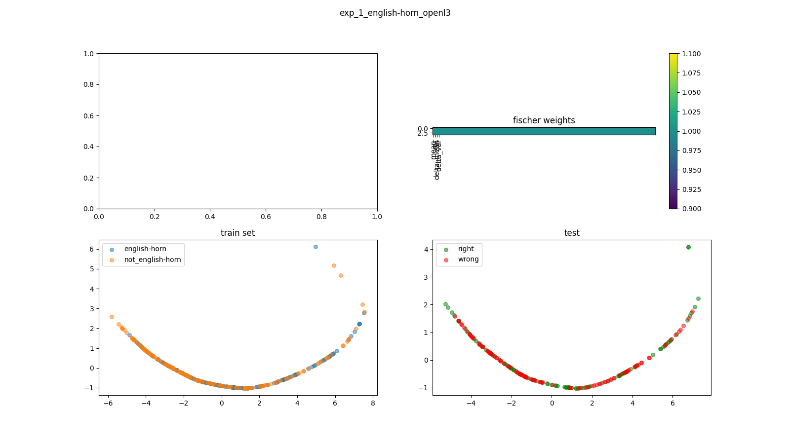
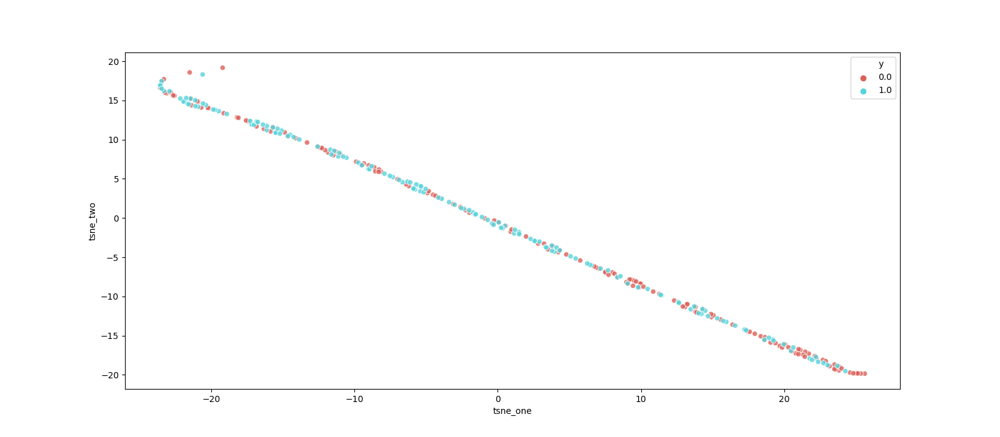
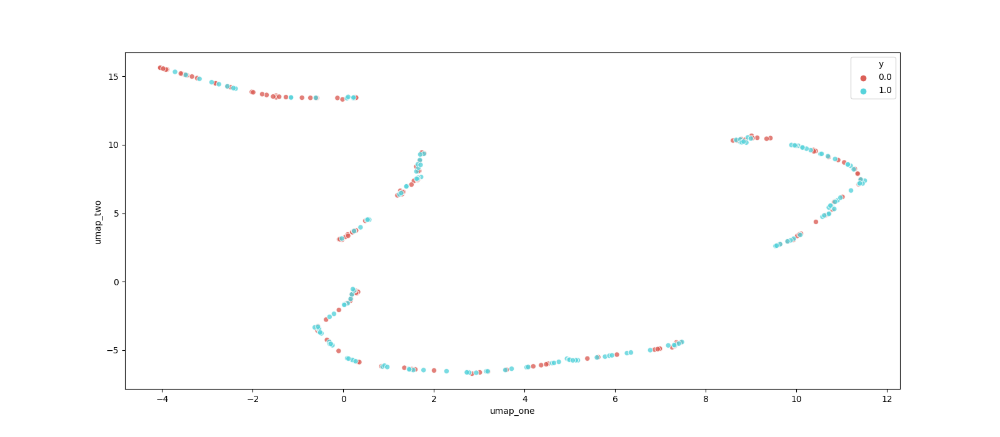

## notes on OpenL3 embedding
I tried some dimensionality reduction techniques on the OpenL3 embedding. Here are some results:

In the t-SNE and UMAP plots, the blue dots represent english horns, while the red dots represent french horns. 

### with fischer reweighing
#### PCA 

#### t-SNE

#### UMAP

### without fischer reweighing
#### PCA 

#### t-SNE

#### UMAP
