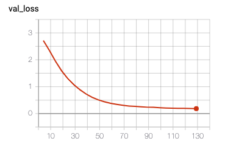
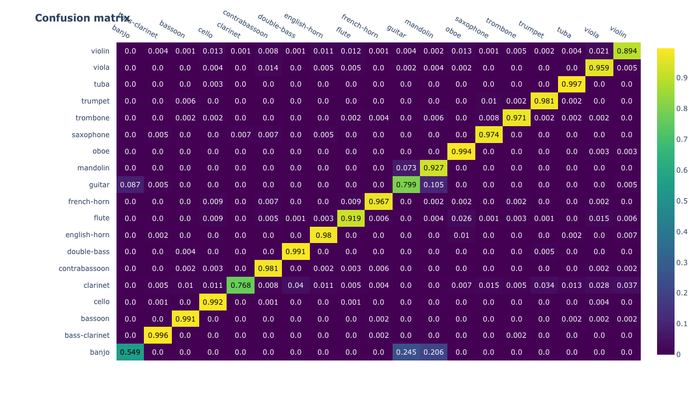
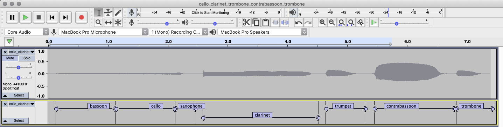

## week 8
currently training a neural net on my cpu: 

- net architecture:
    - input: openl3-mel256-6144-music embedding
        - preprocessing steps:
            - batch normalization to mean 0 and std 1
            - mixup
    - layers:
        - fc1 = nn.Linear(6144, 2048) + dropout (p = 0.5)
        - fc2 = nn.Linear(2048, 512) + droput (p = 0.5)
        - fc2 = nn.Linear(512, 256) + dropout (p = 0.5)
        - fc3 = nn.Linear(256, 19) 
        - log softmax
    - output:
        - log class probabilities (19 classes)
    - loss:
        - negative log likelihood

    - hyperparams:
        - learning rate: 1e-4
        - batch size: 2048
        - early stopping for validation loss with patience = 3

*note*: this is pretty similar to what was done in the [OpenL3 paper](https://www.justinsalamon.com/uploads/4/3/9/4/4394963/cramer_looklistenlearnmore_icassp_2019.pdf)

### results (epoch 26):

| validation accuracy | validation f1 |   
|---------------------|-----------------| 
| 94.11 %							 | 90.66%	| 

compare with linear svm:

| validation accuracy | validation f1 |   
|---------------------|-----------------| 
| 91.09 %				  | 88.87%	     | 

validation loss plot:

confusion matrix:  

-----------------

some observations:

dataset  

- **the dataset is imbalanced**:
	- todo: use balanced cross-entropy to compute loss
   - another option: use a [focal loss](https://arxiv.org/pdf/1708.02002.pdf)
- **the audio is too clean, so the model is probably not robust to noisy audio**: 
	- I'm thinking about using scaper to augment the dataset to fix this.  
- **lots of single notes**: there are very few phrases and slurs in the audio samples. could this hurt the model? 

<!--predicting with overlapping frames:  

- train model on 1s frames with 0.1s hop size
- every 0.1s window, get all predictions that overlap with that window, and use a pooling function to get a prediction for this frame. 
    - sort of a frame-wise [multiple instance learning](https://arxiv.org/pdf/1810.09050.pdf)-->

### audacity labeler

I added a silence trim to the preprocessing steps audacity labeler. Before feeding into the embedding, the audio is cut off into slices with a -80dB threshold (relative to the frame with the highest amplitude in the audio file)

this is what that audio track (cello -> clarinet -> trombone -> contrabassoon -> trombone) looks like after silence detection. 

(this is still the linear svm model)

