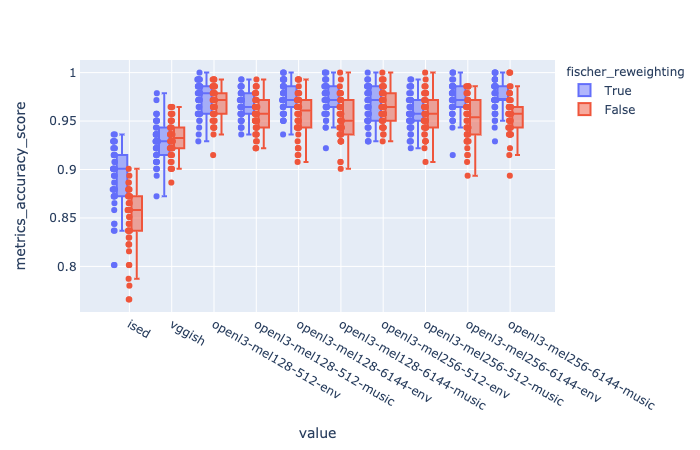
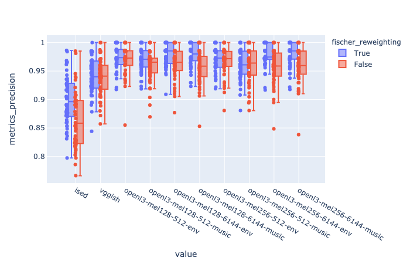
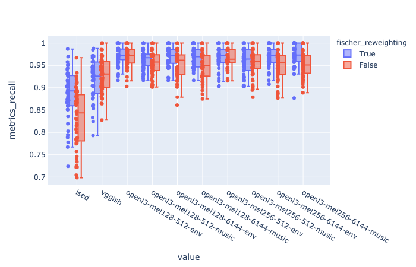
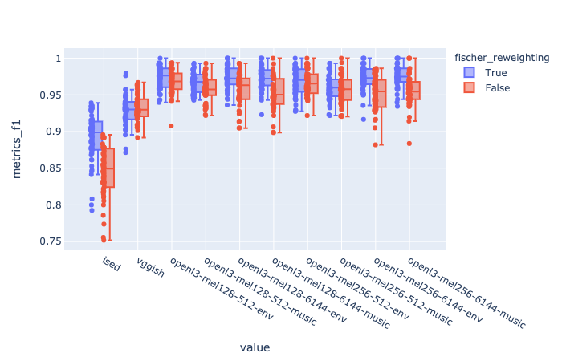
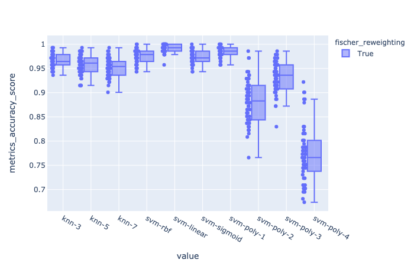
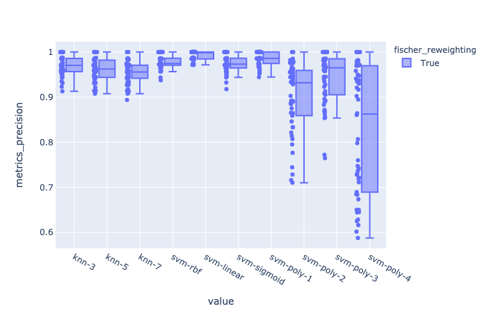
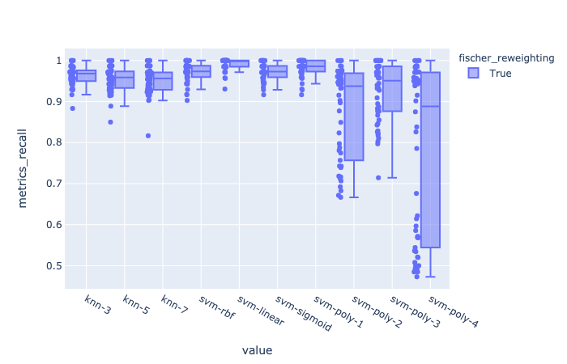
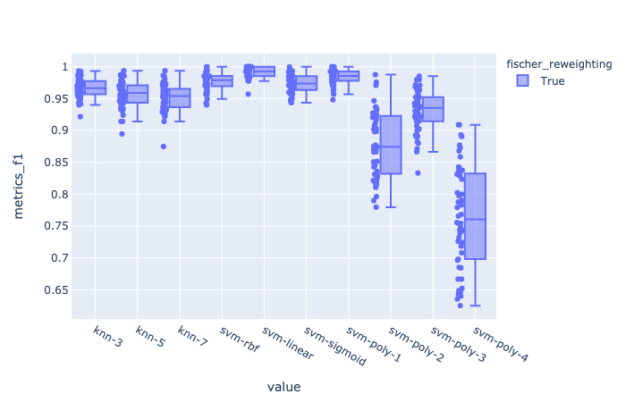

# things that I've done these past two weeks

## audacity labeler
I've forked Jack's labeler repo and updated his code to work with the latest Audacity commit. 

However, I realized that prototyping classification models and porting them from Python to C++ requires a lot of extra work and library-specific adjustments that make trying out different models directly in the C++ implementation rather impractical. 

Instead, I've made a labeling Python server for Audacity that works exactly like Jack's, but is written in Python for easier prototyping. 

The audacity labeler repository is [here](https://github.com/hugofloresgarcia/audacity-labeling). 

The master branch contains the Python implementation of the labeler, while the cpp-labeler branch contains jack's C++ labeler. 

Build/installation instructions are in the repo. 

*note*: both branches only predict 'silence' as an output, since they are using Jack's precompiled model, which hasn't been trained yet.

## visualizing embeddings
I computed VGGish and OpenL3 embeddings and visualized the dataset using t-SNE. Look at the plots here:  

- [vggish](./figs/vggish_tsne.html)
- [openl3](./figs/openl3_tsne.html)

## comparing embeddings

ran 50 trials, comparing the preprocessor representation used. 

The task is to classify english horns from french horns. A 3-Nearest-Neighbor classifier was implemented. 

signal flow:   
- raw audio --> preprocessor --> PCA (components=all) --> fischer reweighing --> classifier

conditions tested:

- ised (with and without fischer reweighing)
- vggish(with and without fischer reweighing)
- openl3 model variants (with and without fischer reweighing)
	- input representation: mel128 or mel256
	- embedding sizes: 512 and 6144 dimensions
	- content type: environmental or music

number of training samples (per trial): 200
number of validation samples (per trial): 140

every trial, a subset of the dataset would be randomly sampled with a fixed random seed for all conditions. the seed number for each trial is stored in its .yaml config.

### accuracy

### precision

### recall

### f1 score

The OpenL3 variants show better performance than both vggish and ised. Also, it seems as if the OpenL3 models benefit from fischer reweighing less than ISED and VGGish, probably because the classes may already be (mostly) linearly separable in OpenL3 space. 

## comparing classifiers

ran 50 trials, comparing the classifier used. 

The task is to classify english horns from french horns. 

preprocessor: openl3-mel128-512-music variant

signal flow:  
raw audio --> preprocessor --> PCA (components=all) --> fischer reweighing --> classifier

conditions tested:

- K Nearest Neighbors 
	- K=3 
	- K=5
	- K=7
- SVM
	- RBF kernel
	- Linear kernel
	- Sigmoid kernel
	- Poly kernels (degree 2, 3, 4)

number of training samples (per trial): 200
number of validation samples (per trial): 140

every trial, a subset of the dataset would be randomly sampled with a fixed random seed for all conditions. the seed number for each trial is stored in its .yaml config.

### accuracy

### precision

### recall

### f1 

Linear SVM seems to take the cake here. 