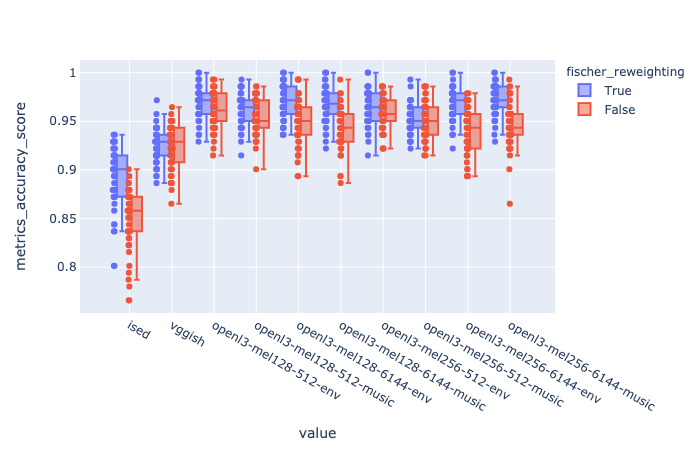
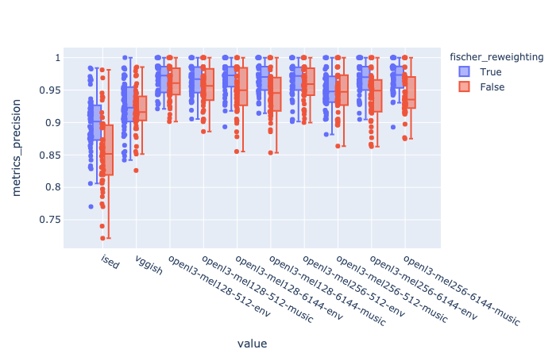
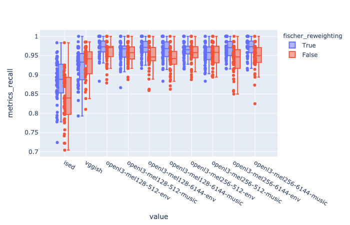
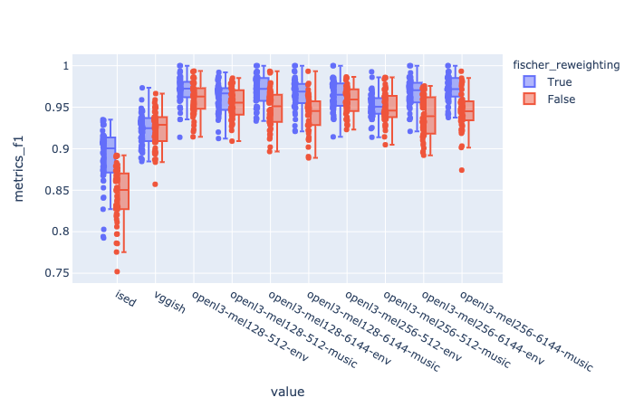
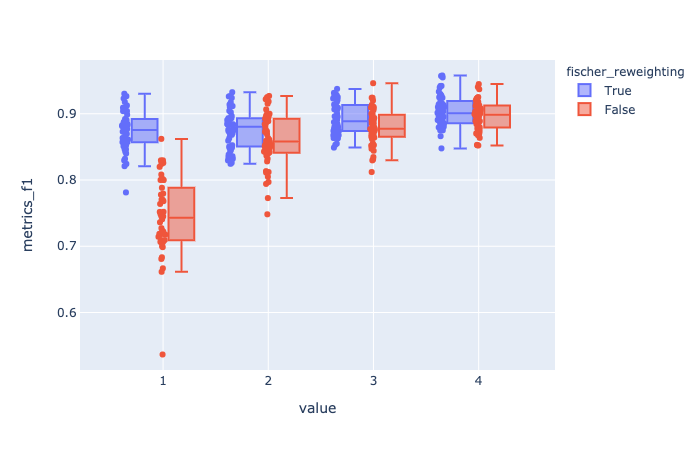
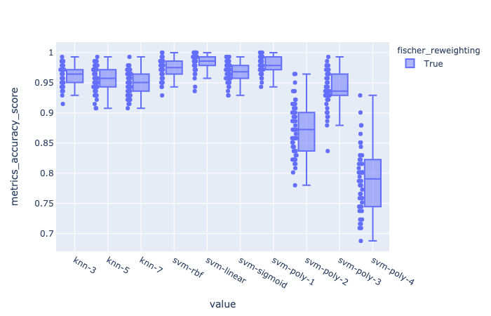
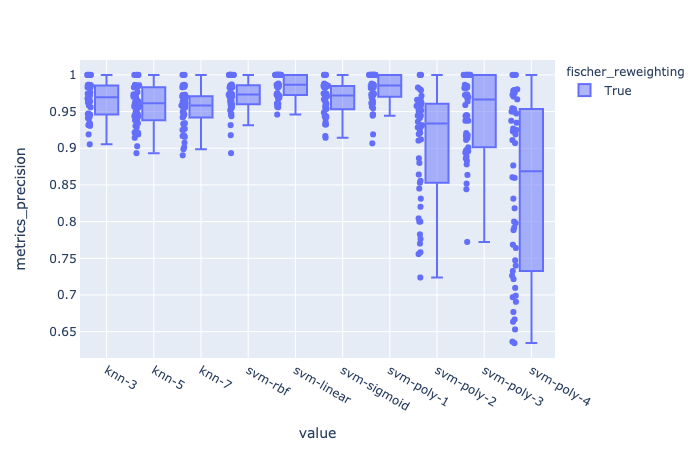
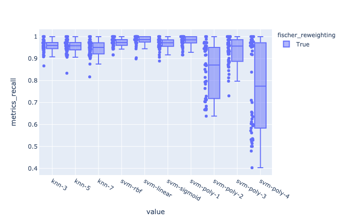

# things that I've done these past two weeks

## audacity labeler
I've forked Jack's labeler repo and updated his code to work with the latest Audacity commit. 

However, I realized that prototyping classification models and porting them from Python to C++ requires a lot of extra work and library-specific adjustments that make trying out different models directly in the C++ implementation rather impractical. 

Instead, I've made a labeling Python server for Audacity that works exactly like Jack's, but is written in Python for easier prototyping. 

The audacity labeler repository is [here](https://github.com/hugofloresgarcia/audacity-labeling). 

The master branch contains the Python implementation of the labeler, while the [cpp-labeler](https://github.com/hugofloresgarcia/audacity-labeling/tree/cpp-labeler) branch contains jack's C++ labeler (updated to work with Audacity's cmake build). 

Build/installation instructions are in the repo. 

*note*: both branches only predict 'silence' as an output, since they are using Jack's precompiled model, which hasn't been trained yet.

## visualizing dataset w/ embeddings
I computed VGGish and OpenL3 embeddings and visualized the dataset using t-SNE. Look at the plots here:  

- [vggish](./figs/vggish_tsne.html)
- [openl3](./figs/openl3_tsne.html)

## comparing embeddings

ran 50 trials, comparing the preprocessor representation used. 

The task is to classify english horns from french horns. A 3-Nearest-Neighbor classifier was implemented. 

signal flow:   

- raw audio --> preprocessor --> PCA (components=16) --> fischer reweighting --> classifier

conditions tested:

- ised (with and without fischer reweighting)
- vggish(with and without fischer reweighting)
- openl3 model variants (with and without fischer reweighting)
	- input representation: mel128 or mel256
	- embedding sizes: 512 and 6144 dimensions
	- content type: environmental or music

number of training samples (per trial): 200
number of validation samples (per trial): 140

every trial, a subset of the dataset would be randomly sampled with a fixed random seed for all conditions. the seed number for each trial is stored in its .yaml config.

### accuracy

### precision

### recall

### f1 score

The OpenL3 variants show much better performance than both vggish and ised.

### pairwise tests for fischer reweighting
These are the results for pairwise tests for each embedding before and after fischer reweighting. 

|                          | t_test stat | t_test pval    | wilcoxon_stat | wilcoxon_pval   | 
|--------------------------|-------------|-----------------|--------------|-----------------| 
| ised                     | -10.0892627 | 2e-13           | 17.0         | 3.1494e-09      | 
| vggish                   | 0.4868285   | 0.6285955811352 | 512.0        | 0.4356867512842 | 
| openl3-mel128-512-env    | -4.8366817  | 1.40276356e-05  | 143.0        | 3.99138596e-05  | 
| openl3-mel128-512-music  | -3.7397758  | 0.0004910251359 | 181.5        | 0.00043174093   | 
| openl3-mel128-6144-env   | -9.160914   | 4.1e-12         | 23.0         | 1.03466e-08     | 
| openl3-mel128-6144-music | -11.5280025 | 0.0             | 0.0          | 2.3968e-09      | 
| openl3-mel256-512-env    | -2.4769165  | 0.0168271160691 | 349.0        | 0.036418422055  | 
| openl3-mel256-512-music  | -0.2514963  | 0.8025040252926 | 499.0        | 0.6502585697615 | 
| openl3-mel256-6144-env   | -9.7491713  | 6e-13           | 0.0          | 7.6159e-09      | 
| openl3-mel256-6144-music | -9.9450644  | 3e-13           | 22.0         | 6.4273e-09      | 

- It looks like only some OpenL3 variants benefit from fischer reweighting. Moreover, the benefit doesn't look very significant (from looking at the boxplots)
- ISED benefits a good deal from feature reweighting
- VGGish doesn't benefit from fischer reweighting as much when the number of PCA components are greater than 1.

#### vggish -> number of PCA components vs F1 score (with and without reweighting)
 

## comparing classifiers

ran 50 trials, comparing the classifier used. 

The task is to classify english horns from french horns. 

preprocessor: openl3-mel128-512-music variant

signal flow:  

- raw audio --> preprocessor --> PCA (components=16) --> fischer reweighting --> classifier

conditions tested:

- K Nearest Neighbors 
	- K=3 
	- K=5
	- K=7
- SVM
	- RBF kernel
	- Linear kernel
	- Sigmoid kernel
	- Poly kernels (degree 2, 3, 4)

number of training samples (per trial): 200
number of validation samples (per trial): 140

every trial, a subset of the dataset would be randomly sampled with a fixed random seed for all conditions. the seed number for each trial is stored in its .yaml config.

### accuracy

### precision

### recall

### f1 

Linear SVM seems to take the cake here. 